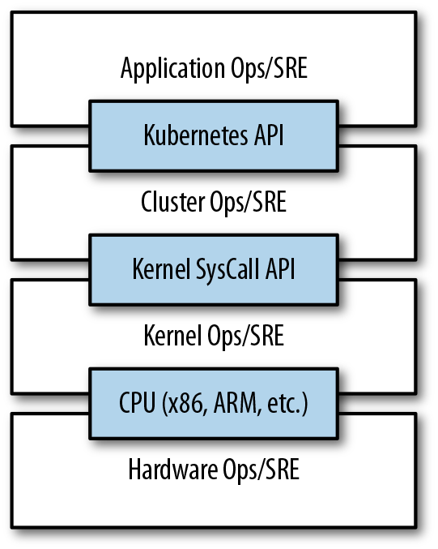

# kubernetes 简介

Kubernetes intends to radically simplify the task of building, deploying, and maintaining distributed systems. Kubernetes can help provide:

- Velocity
- Scaling (of both software and teams)
- Abstracting your infrastructure
- Efficiency

## Velocity

velocity is measured not in terms of the raw number of features you can ship per hour or day, but rather in terms of the number of things you can ship __while maintaining a highly available service__. The core concepts that enable this are:

- immutability, 
- declarative configuration, 
- and online self-healing systems.

### The Value of Immutability

Containers and Kubernetes encourage developers to build distributed systems that adhere to the __principles of immutable infrastructure__. With immutable infrastructure, once an artifact is created in the system it does not change via user modifications.

Two different ways to upgrade your software:

1. You can log into a container, run a command to download your new software, kill the old server, and start the new one.
2. You can build a new container image, push it to a container registry, kill the existing container, and start a new one.

The key differentiation is the artifact that you create, and the record of how you created it. These records make it easy to understand exactly the differences in some new version and, if something goes wrong, determine what has changed and how to fix it.

Additionally, building a new image rather than modifying an existing one means the old image is still around, and can quickly be used for a rollback if an error occurs.

Immutable container images are at the core of everything that you will build in Kubernetes.  It is possible to imperatively change running containers, but this is an antipattern to be used only in extreme cases where there are no other options.

### Declarative Configuration

Immutability extends beyond containers running in your cluster to the way you describe your application to Kubernetes.

Everything in Kubernetes is a _declarative configuration object_ that represents the desired state of the system. It is Kubernetes’s job to ensure that the actual state of the world matches this desired state.

Declarative configuration does not have to be executed to be understood. Further, the traditional tools of software development can be used in declarative configuration in ways that are impossible for imperative instructions.

The combination of declarative state stored in a version control system and Kubernetes’s ability to make reality match this declarative state makes rollback of a change trivially easy.

### Self-Healing Systems

When kubernetes receives a desired state configuration, it does not simply take actions to make the current state match the desired state a single time. It continuously takes actions to ensure that the current state matches the desired state.

Self-healing systems like Kubernetes both reduce the burden on operators and improve the overall reliability of the system by performing reliable repairs more quickly.

## Scaling Your Service and Your Teams

Kubernetes achieves scalability by favoring _decoupled architectures_.

### Decoupling

In a decoupled architecture each component is separated from other components by defined APIs and service load balancers.

Decoupling components via load balancers makes it easy to scale the programs that make up your service, because increasing the size (and therefore the capacity) of the program can be done without adjusting or reconfiguring any of the other layers of your service.

Decoupling servers via APIs makes it easier to scale the development teams because each team can focus on a single, smaller microservice with a comprehensible surface area.

### Easy scaling for Applications and Clusters

When there are resources available in your cluster to consume, scaling your service upward is simply a matter of changing a number in a configuration file, asserting this new declarative state to Kubernetes, and letting it take care of the rest. Alternately, you can set up autoscaling and simply let Kubernetes take care of it for you.

When need to scale up the cluster itself, this can be accomplished via a few simple commands or via a prebaked machine image.

### Scaling Development Teams with Microservices

The ideal team size is the “two-pizza team,” or roughly six to eight people. Kubernetes provides numerous abstractions and APIs that make it easier to build these decoupled microservice architectures:

- pods
- kubernetes services, load balancing, naming and discovery to isolate one microservice from another.
- namespaces, isolation and access control
- ingress, combine multiple microservices into a single externalized API surface area.

### Separation of Concerns for Consistency and Scaling

The application developer relies on the service-level agreement (SLA) delivered by the container orchestration API, without worrying about the details of how this SLA is achieved. 

Likewise, the container orchestration API reliability engineer focuses on delivering the orchestration API’s SLA without worrying about the applications that are running on top of it.

## Abstracting Your Infrastructure

Application-oriented container APIs like Kubernetes has two concrete benefits:

- separates developers from specific machines
- kubernetes has a number of plug-ins that can abstract you from a particular cloud

Building on top of Kubernetes’s application-oriented abstractions ensures that the effort that you put into building, deploying, and managing your application is truly portable across a wide variety of environments.

## Efficiency

Kubernetes provides tools that automate the distribution of applications across a cluster of machines, ensuring higher levels of utilization than are possible with traditional tooling.

## summary

Kubernetes was built to radically change the way that applications are built and deployed in the cloud. Fundamentally, it was designed to give developers more velocity, efficiency, and agility. 
